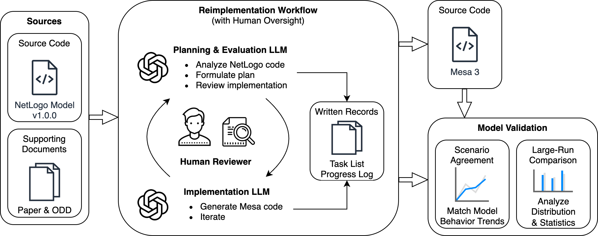
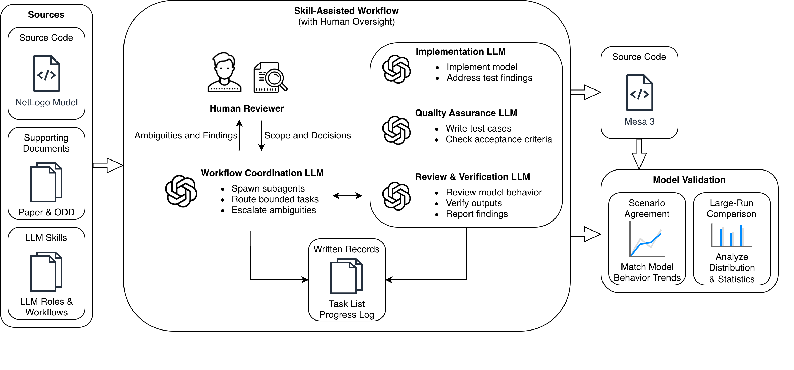

# LLM-Assisted Agent-Based Model Replications in Mesa

## Overview

This repository contains Mesa replications of the Ya-TASERPS, Sakoda's checkerboard, and Slumulation models in Python. It accompanies a CSSSA 2026 study of large language model-assisted, cross-platform replication of agent-based models (currently under review).

<p align="center">
  
  <br>
  <strong>Researcher-mediated workflow</strong> used for the Ya-TASERPS replication.
</p>

<p align="center">
  
  <br>
  <strong>Skill-assisted workflow</strong> used for the Sakoda and Slumulation replications.
</p>

## Repository Structure

```text
.
├── README.md          <- Project overview and reproduction instructions.
├── pyproject.toml     <- Python package and dependency configuration.
├── workflows/         <- Workflow diagrams.
│   ├── workflow_researcher_mediated.png
│   └── workflow_skill_assisted.png
├── sakoda/            <- Sakoda checkerboard model.
│   ├── ...
│   └── app.py
├── slumulation/       <- Slumulation model.
│   ├── ...
│   └── app.py
├── yatasterps/        <- Ya-TASERPS model.
│   ├── ...
│   └── app.py
├── tests/             <- Tests for all three models.
├── results/           <- Result data underlying the paper.
│   ├── yatasterps/
│   │   ├── runs/
│   │   └── summaries/
│   ├── sakoda/
│   │   ├── runs/
│   │   ├── summaries/
│   │   └── boards/
│   └── slumulation/
│       ├── netlogo/
│       ├── mesa/
│       └── summaries/
└── references/        <- NetLogo reference models.
    ├── slumulation/
    ├── yatasterps/
    └── README.md
```

Each model is an independent top-level Python package with its own `app.py`. Run the commands below from the repository root.

## Reproducing the Results

The following commands rerun the Mesa experiments underlying the paper. NetLogo outputs were generated separately using the included NetLogo models and are provided under `results/`; the summary commands analyze those outputs alongside the Mesa outputs. Each result command writes to a new directory under `tmp/`.

### Setup

```bash
python3 -m venv .venv
source .venv/bin/activate
python -m pip install -e ".[dev]"
```

### Interactive Models

```bash
solara run yatasterps/app.py
solara run sakoda/app.py
solara run slumulation/app.py
```

### Tests

```bash
python -m pytest
```

### Ya-TASERPS

Rerun the Mesa parameter sweep and write raw runs and summaries:

```bash
python -m yatasterps.replication \
  --run-sweep \
  --output-dir tmp/yatasterps
```

Regenerate NetLogo and Mesa summaries from the included raw runs:

```bash
python -m yatasterps.replication \
  --summarize-runs \
  --output-dir tmp/yatasterps-summaries
```

### Sakoda

Rerun all eight scenarios with the documented seeds and write JSON and CSV results:

```bash
python -m sakoda.validation \
  --output-dir tmp/sakoda
```

### Slumulation

Rerun the Mesa baseline, politics/developer, and population-growth experiments:

```bash
python -m slumulation.runner \
  --output-dir tmp/slumulation/mesa
```

Generate CSV summaries from the regenerated Mesa outputs and included NetLogo outputs:

```bash
python -m slumulation.validation \
  --mesa-dir tmp/slumulation/mesa \
  --netlogo-dir results/slumulation/netlogo \
  --output-dir tmp/slumulation/summaries
```

Generate the slum-size distribution summaries from the included run data:

```bash
python -m slumulation.summaries \
  --output-dir tmp/slumulation/slum-size-summaries
```

## License

The code developed for this study is licensed under the [MIT License](LICENSE). The included NetLogo files are source materials used in the study and are documented separately in [references/README.md](references/README.md).
